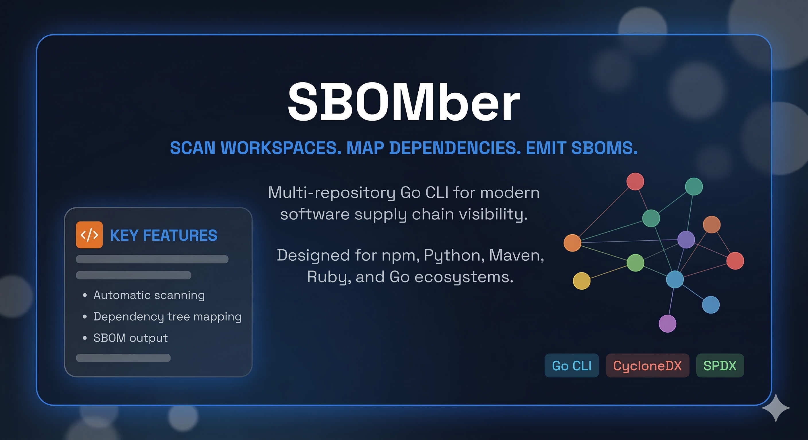

<p align="center">
  
</p>

<p align="center">
  <a href="https://github.com/fluxsecurity/SBOMber/actions/workflows/ci.yml"></a>
  
  
  
  
</p>

<p align="center">
  <strong>Scan a folder full of repositories. Generate SBOMs for local workflows and CI/CD pipelines.</strong>
</p>

SBOMber is an open-source Go CLI for scanning directories of locally cloned Git repositories and generating software bill of materials artifacts at scale.

The first milestone is clear: discover repositories, detect their ecosystems, and generate standards-based SBOMs. The tool is being designed for both local developer workflows and automated CI/CD execution. After that, the project expands into dependency metadata, outdated package analysis, vulnerability reporting, and supply-chain signals.

## What It Is Built For

- scanning a workspace that contains many Git repositories
- detecting repo stacks from manifests and lockfiles
- generating `CycloneDX` and `SPDX` output
- handling direct and transitive dependencies
- fitting into CI/CD, scripts, and local security workflows

## CI/CD Targets

SBOMber is intended to run cleanly in non-interactive automation environments such as:

- `GitHub Actions`
- `GitLab CI/CD`
- `Jenkins`
- `Azure DevOps`

That means the CLI should be designed around:

- deterministic exit codes
- machine-readable output
- configurable output paths
- non-interactive flags
- simple integration into existing pipeline steps

## Platform Targets

SBOMber is being built as a cross-platform Go CLI for:

- `macOS`
- `Linux`
- `Windows`

Current development is source-first. Planned distribution targets include:

- GitHub Releases binaries
- `go install`
- Homebrew formula
- Scoop package

## Ecosystem Targets

The current product direction is multi-stack support for repositories using:

- `npm` / `package-lock.json`
- `Python` / `requirements.txt`, `pyproject.toml`, lockfiles
- `Maven` / `pom.xml`
- `Ruby` / `Gemfile.lock`
- `Go` / `go.mod`, `go.sum`

## Current Status

Phase 1 is in active development:

- interactive CLI with scan menu and export format selection
- recursive Git repository discovery
- ecosystem detection for npm, Python, Maven, Ruby, and Go
- npm direct dependency parsing from `package.json`
- npm transitive dependency parsing from `yarn.lock`
- CI for formatting, vetting, and tests
- OSS community files for issues, PRs, contributions, and security reporting

Next up: CycloneDX and SPDX export to disk.

## Quick Start

### Prerequisites

- Go `1.26` or newer

### Build and run

```bash
make tidy
make build
./bin/sbomber
```

### Run without building

```bash
# Launch interactive mode (landing screen with menu)
make run

# Scan a specific folder
make scan SCAN_PATH=/path/to/your/projects

# Scan with a specific export format
make scan SCAN_PATH=/path/to/repo SCAN_ARGS='--format both'
```

### Run tests

```bash
make test
```

## Example Output

```text
  ____  ____   ___  __  __ _
 / ___|| __ ) / _ \|  \/  | |__   ___ _ __
 \___ \|  _ \| | | | |\/| | '_ \ / _ \ '__|
  ___) | |_) | |_| | |  | | |_) |  __/ |
 |____/|____/ \___/|_|  |_|_.__/ \___|_|

 Select an option:
  1) Scan current folder
  2) Scan custom folder
  3) Version
  4) Help
```

Scanning an npm project:

```text
Found 1 repository under /workspace/prettier
  prettier  [npm]

npm dependency summary for prettier:
  Direct dependencies (package.json):  146
  Transitive dependencies (yarn.lock): 953
  Total known dependencies:            1099
```

## Roadmap

- repository discovery and workspace scanning
- ecosystem detection from manifests and lockfiles
- SBOM generation for supported stacks
- CI/CD-friendly execution and export flows
- metadata and outdated dependency reporting
- vulnerability and supply-chain analysis

## Project Layout

```text
cmd/sbomber/        CLI entrypoint
internal/cli/       interactive CLI and scan flow
internal/discovery/ recursive repository scanning
internal/ecosystem/ manifest-based ecosystem detection
internal/deps/      shared dependency data model
internal/npm/       npm and yarn.lock parsing
docs/assets/        branding and repository visuals
.github/            CI and community health files
```

## Development

```bash
make fmt
make test
make vet
make ci
```

## Contributing

See [CONTRIBUTING.md](./CONTRIBUTING.md) for setup and contribution workflow.

## License

Licensed under [Apache-2.0](./LICENSE).
