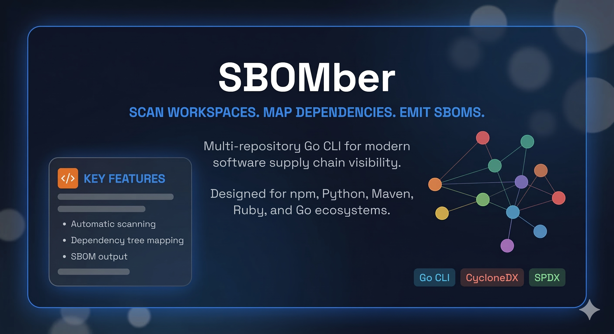

<p align="center">
  
</p>

<p align="center">
  <a href="https://github.com/fluxsecurity/SBOMber/actions/workflows/ci.yml"></a>
  
  
</p>

<p align="center">
  <strong>Scan repositories. Generate SBOMs. Find vulnerabilities. Verify accuracy.</strong>
</p>

---

SBOMber is a high-performance, open-source CLI that scans local and remote Git repositories, extracts dependencies, generates SBOM artifacts (CycloneDX/SPDX), finds CVEs, and provides supply chain health insights.

## Highlights

- **Remote GitHub scanning** - Scan any public/private repo without cloning
- **Parallel processing** - Fetch manifests concurrently for 10x faster scans
- **Dependency chain tracking** - Trace how any package enters your project
- **SBOM verification** - Compare output against ground truth with precision/recall metrics
- **Supply chain health** - Risk scoring based on maintainer activity, contributors, and more
- **Supports** - npm, Python, Go, Maven, Ruby ecosystems

## Quick Start

```bash
# Build
make build

# Run interactive TUI
./bin/sbomber

# Scan local repos
./bin/sbomber scan /path/to/repos --format cyclonedx --include-vulnerabilities

# Scan GitHub repos directly (no clone needed!)
./bin/sbomber github https://github.com/expressjs/express
```

**Requirements:** Go 1.26+ and [Grype](https://github.com/anchore/grype) (for vulnerability scanning)

## Features

| Feature | Status |
|---------|--------|
| Interactive TUI | done |
| Multi-repo Git scanning | done |
| npm/yarn dependencies | done |
| Python requirements.txt | done |
| Maven pom.xml | done |
| Ruby Gemfile.lock | done |
| Go go.mod | done |
| CycloneDX export | done |
| SPDX export | done |
| Grype vulnerability scan | done |
| HTML vulnerability report | done |
| Remote GitHub scanning | done |
| Parallel manifest fetching | done |
| Supply chain health metrics | done |
| Dependency chain tracing | done |
| SBOM accuracy verification | done |
| Direct/transitive filtering | done |

---

## Usage

### Interactive Mode

```bash
./bin/sbomber
```

Navigate with arrow keys, select with Enter. The TUI provides guided workflows for all features.

After a local scan of a single repo, the results screen offers **Check ground-truth accuracy** — point it at a ground-truth SBOM (see [Verified accuracy](#verified-accuracy) below) and it runs the same comparison `sbomber verify` does, inline. Only offered when the scan covered exactly one repo, since a comparison needs exactly one generated SBOM to be meaningful.

### Local Scanning

```bash
# Scan current directory
./bin/sbomber scan .

# Scan with both SBOM formats
./bin/sbomber scan /path/to/repos --format both

# Include vulnerability scanning
./bin/sbomber scan /path/to/repos --include-vulnerabilities
```

### GitHub Remote Scanning

Scan any GitHub repository directly via API - no cloning required.

```bash
# Basic scan
./bin/sbomber github https://github.com/expressjs/express

# With supply chain health metrics
./bin/sbomber github --health https://github.com/django/django

# With vulnerability scanning
./bin/sbomber github --include-vulnerabilities https://github.com/lodash/lodash

# Multiple repos at once
./bin/sbomber github https://github.com/org/repo1 https://github.com/org/repo2
```

**Authentication:** Set `GITHUB_TOKEN` for higher rate limits (5000 req/hr vs 60 req/hr).

```bash
export GITHUB_TOKEN=ghp_your_token_here
```

### Dependency Chain Tracing

Understand how dependencies enter your project.

```bash
# Trace a specific package
./bin/sbomber trace . lodash

# Show full dependency tree
./bin/sbomber trace . express --tree

# Filter by ecosystem
./bin/sbomber trace . --list --ecosystem npm

# Filter transitive dependencies only
./bin/sbomber trace . --list --type transitive

# Show potential false positives (test/example deps)
./bin/sbomber trace . --fp --list
```

### Vulnerable-function localisation

Work out which function an advisory actually implicates, so usage evidence
can be compared against it instead of against the whole package.

```bash
# Read the scan's canonical-scan.json, write localisation.json
./bin/sbomber localise --canonical-scan out/canonical-scan.json --out out/localisation.json

# Keep the per-method evidence trace and run every method for comparison
GITHUB_TOKEN=$(gh auth token) ./bin/sbomber localise --canonical-scan out/canonical-scan.json \
  --out out/localisation.json --trace out/localisation-trace.json --all-methods
```

Methods run in fallback order, cheapest and most reliable first: structured
advisory metadata, the fix commit the advisory links to, function names in the
advisory prose, and finally a diff of the vulnerable and fixed npm tarballs.
A finding no method can localise is reported as `unknown` and falls back to
package-level treatment; the unknown rate is a result, not a failure.

Downloaded package code is **never executed**. Tarballs are verified against
the registry's integrity value, read in memory, and every artefact records
`executed: false`. The output follows `contracts/localisation.schema.json`.
Measured behaviour on ten curated CVEs is in `spikes/localisation/`.

### SBOM Verification

Compare your generated SBOM against a ground truth to measure accuracy.

```bash
# Compare against a reference SBOM
./bin/sbomber verify reference.cdx.xml my-output.cdx.xml

# Output as JSON (for CI/CD)
./bin/sbomber verify reference.json generated.json --json
```

**Output format** (field layout only — these are placeholder digits, not a
measured result; see *Verified accuracy* below for a real one):
```
╔══════════════════════════════════════════════════════════════╗
║                    SBOM VERIFICATION REPORT                  ║
╚══════════════════════════════════════════════════════════════╝

│ Precision:        NN.N%  (correct / total reported)          │
│ Recall:           NN.N%  (found / total in ground truth)     │
│ F1 Score:         NN.N%  (harmonic mean)                     │

Overall Grade: <grade>
```

### Verified accuracy

No accuracy figure for SBOMber is quoted anywhere (README, report, poster,
client conversation) unless it has a committed ground-truth fixture and a
`sbomber verify` run behind it — an unsourced percentage is an integrity
problem, not just an accuracy one.

The one currently on record:
[`testdata/fixtures/ground-truth/npm-basic`](testdata/fixtures/ground-truth/npm-basic)
— method, fixture, and full `sbomber verify` output committed, run twice:
before and after the npm package-lock reconciliation fix
([`docs/design/npm-identity-reconciliation.md`](docs/design/npm-identity-reconciliation.md)).
Precision/Recall/F1 were 100% in both runs; **Version Accuracy went from 0%
to 100%** once the parser started reconciling `package.json` ranges against
`package-lock.json` resolutions instead of reporting the raw semver range.
See the fixture's `METHOD.md` for both runs' numbers and what's still not
covered by this one small fixture (the nested-version case, covered instead
by dedicated unit tests — see that same design doc).

That comparison is no longer just a one-time snapshot: `go test ./...`
reruns it automatically (`TestGroundTruthFixturesDoNotRegress`) and fails
the build if a future change drops any metric below what's committed —
the same mechanism that would have caught the bug above the moment it was
reintroduced, rather than requiring someone to notice.

---

## Performance

SBOMber uses **parallel processing** for maximum speed:

| Operation | Approach | Benefit |
|-----------|----------|---------|
| Manifest fetching | Concurrent goroutines | 10x faster for multi-manifest repos |
| Health resolution | Worker pool (10 workers) | Parallel API calls per dependency |
| File parsing | Streaming parsers | Low memory footprint |

**Example:** Scanning Facebook React (157 manifest files) completes in ~2 seconds.

---

## Output

Reports are saved to `~/.sbomber/reports/`:

```
~/.sbomber/reports/
├── my-project_abc123/
│   ├── sbom-cyclonedx.xml      # CycloneDX 1.5
│   ├── sbom.spdx               # SPDX 2.3
│   └── vulnerability-report.html
└── github-scan_def456/
    └── expressjs_express/
        ├── sbom-cyclonedx.xml
        └── vulnerability-report.html
```

### HTML Vulnerability Report

Interactive report with:
- Severity breakdown (Critical/High/Medium/Low)
- Direct vs transitive dependency filtering
- Test data detection (auto-flags fixtures/examples)
- False positive marking
- CVE links to NVD/GitHub advisories

---

## Supply Chain Health

When scanning with `--health`, SBOMber evaluates each dependency:

| Metric | What it measures |
|--------|------------------|
| Last commit | Days since last activity |
| Contributors | Bus factor / maintainer risk |
| Stars | Community adoption |
| License | Compliance risk |

Risk levels: **Low** (healthy) / **Medium** (monitor) / **High** (investigate)

---

## Development

```bash
make fmt      # format code
make test     # run tests  
make vet      # run go vet
make build    # build binary
make ci       # run full CI pipeline
```

## License

[Apache-2.0](./LICENSE)
